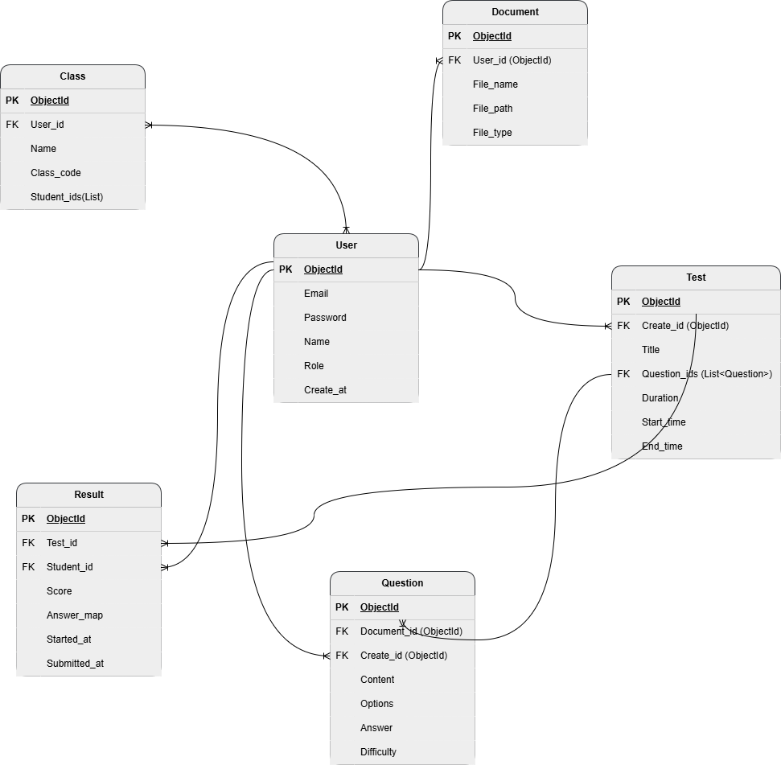

# Nghiên cứu xây dựng Website tự động tạo bộ câu hỏi ôn tập từ tài liệu hỗ trợ giáo viên kiểm tra sinh viên ôn luyện kèm hệ thống thống kê

## 1. Giới thiệu đề tài
Hệ thống hỗ trợ giáo viên tạo bộ câu hỏi ôn tập tự động từ tài liệu
PDF/DOCX, sử dụng AI (GPT), kết hợp giao diện ReactJS, backend FastAPI
và cơ sở dữ liệu MongoDB.

## 2. Các tác nhân hệ thống (Actors)
-   Hệ thống được phân quyền chặt chẽ với 3 đối tượng người dùng chính:
-   Quản trị viên (Admin): Người vận hành hệ thống, chịu trách nhiệm quản lý người dùng và cấu hình lõi.
-   Giáo viên (Teacher): Người quản lý lớp học, tạo nội dung ôn tập và theo dõi sinh viên.
-   Sinh viên (Student): Người tham gia lớp học, thực hiện các bài ôn luyện và xem kết quả.

## 3. Danh sách tính năng
### 3.1 Phân hệ Admin (Quản trị hệ thống)
-   Quản lý người dùng
-   Cấu hình AI
-   Gửi thông báo hệ thống
### 3.2 Phân hệ Giáo viên
-   Tạo lớp học
-   Quản lý sinh viên
-   Upload tài liệu
-   Sinh câu hỏi AI
-   Tạo bài kiểm tra
-   Gửi thông báo lớp
-   Xem thống kê
### 3.3 Phân hệ sinh viên
-   Tham gia lớp học
-   làm bài kiểm tra
-   Xem kết quả chi tiết
-   Nhận thông báo

## 4. Công nghệ sử dụng
-   Frontend: ReactJS, TailwindCSS.
-   Backend: FastAPI.
-   Database: MongoDB (NoSQL).
-   AI Service: OpenAI API (GPT-5.0-nano).

## 5. Thiết kế cơ sở dữ liệu
